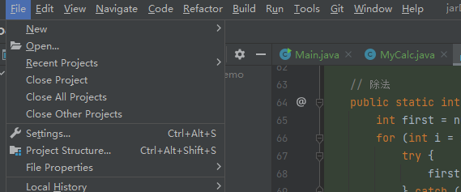
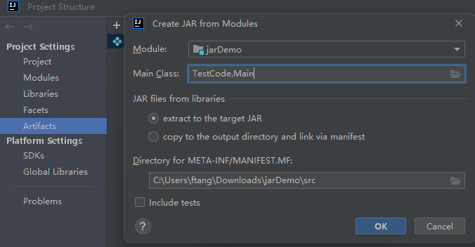
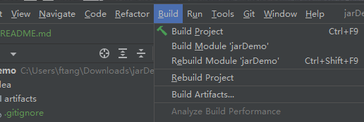
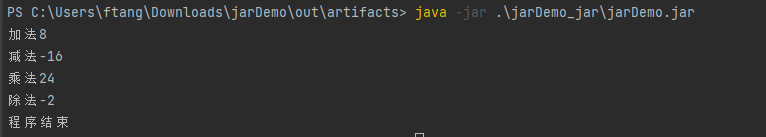

## Java中jar包的创建和使用
创建好项目后创建源文件。

Main.java
```java
package TestCode;

import TestCode.cukor.calc.MyCalc;

public class Main {
    public static void main(String[] args) {
        int result;
        result = MyCalc.add(1, 0, 3, 4);
        printResult("加法", result);
        result = MyCalc.sub(9, 32, 3, -10);
        printResult("减法", result);
        result = MyCalc.mult(4, 3, 2);
        printResult("乘法", result);
        result = MyCalc.div(4, 2, -1);
        printResult("除法", result);
        System.out.println("程序结束");
    }

    public static void printResult(String string, int result) {
        System.out.println(string + result);
    }
}

```
MyCalc.java
```java
package TestCode.cukor.calc;

public class MyCalc {
    // 加法
    public static int add(int... numbers) {
        int sum = 0;
        for (int i : numbers) {
            sum += i;
        }
        return sum;
    }

    // 减法
    public static int sub(int... numbers) {
        int first = numbers[0];
        for (int i = 1; i < numbers.length; i++) {
            first -= numbers[i];
        }
        return first;
    }

    // 乘法
    public static int mult(int... numbers) {
        int result = 1;
        for (int i : numbers) {
            result *= i;
        }
        return result;
    }

    // 除法
    public static int div(int... numbers) {
        int first = numbers[0];
        for (int i = 1; i < numbers.length; i++) {
            try {
                first /= numbers[i];
            } catch (Exception e) {
                System.out.println("除数不能为0，程序异常：" + e.getMessage());
            }
        }
        return first;
    }
}


```
点击 File-> Project Structure



按以下步骤勾选：工件->加号->JAR->来自具有依赖项的模块中



接下来：选中Build ->build Artifacts, 弹出选项点击build即可：



在out下面生成jar包，使用  java -jar .\jarDemo_jar\jarDemo.jar命令运行看看：

